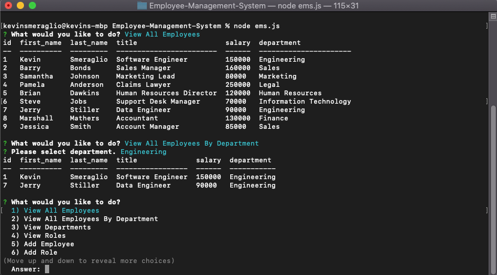
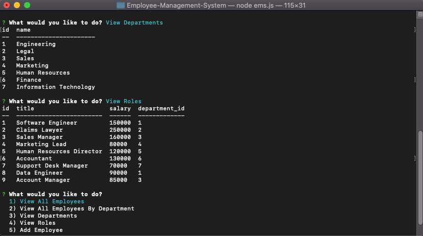
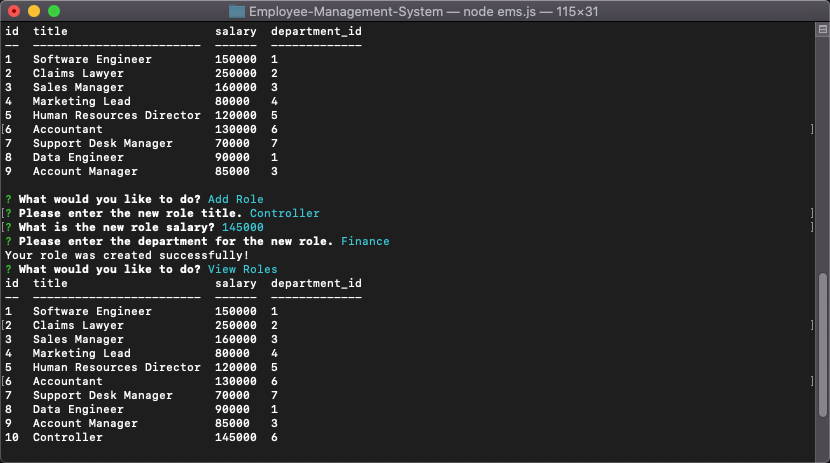
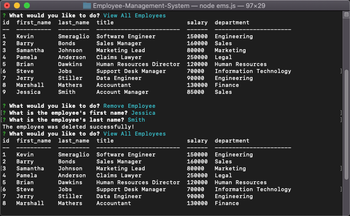

# Employee-Management-System

## Description

  Welcome to the newly improved Employee Management System! This app makes it easy to manage your employees and view pertinent information about your business in a quick and organized manner. From adding or deleting an employee to managing departments, this system should clean up the mess. To accomplish this javascript, express.js, node.js and mySQL were used to create the finished product. Please enjoy the new functionality and feel free to reach out with any improvements for future development!

  

  

  

  

  ## Table of Contents
  
  - [Installation](#installation)
  - [Testing](#tests)
  - [Usage](#usage)
  - [License](#license)
  - [Contributors](#contributors)
  - [Link to Deployed Application](#link)
  - [Questions](#questions)

  ## Installation

  - Run Command: npm install
  - Start Command: node ems.js

  ## Tests
  
  - Run Command: None

  ## Usage

  - This application will run through the command line using node.js and express.js while accessing a database in mySQL. Please see installation instructions and tests for more information.

  ## License

  

  ## Contributors

  - None

  ## Link

  - https://github.com/ksmera01/Employee-Management-System

  ## Questions? 
  
  - Feel free to contact me at ksmera01@gmail.com